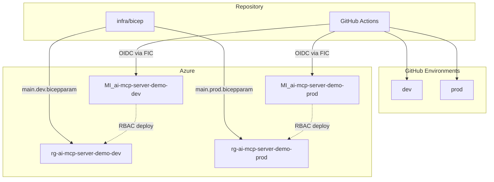
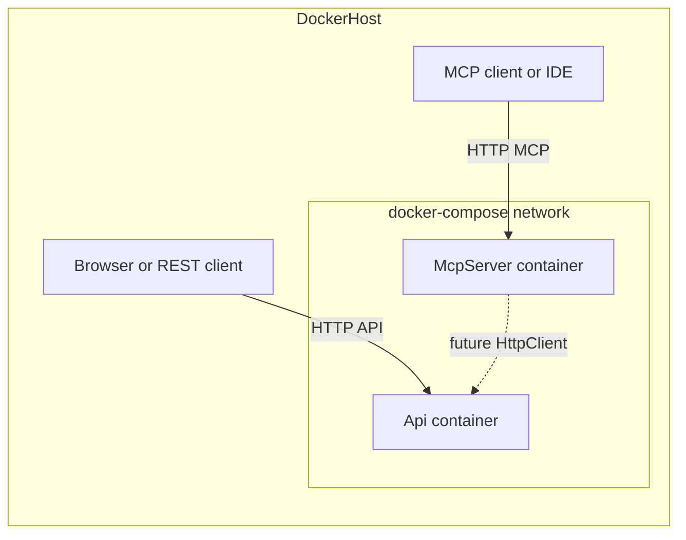

# .NET MCP server + API + Docker Compose

## Clarification on “.NET Framework”

Microsoft’s **Model Context Protocol (MCP) C# SDK** targets modern **.NET** (e.g. .NET 8/9), not legacy **.NET Framework** (4.x). This plan assumes **.NET 9** (current “latest” stable line) unless you prefer **.NET 8 LTS** for longer support windows—either works with the same layout.

## Recommended stack (Microsoft-aligned)

| Piece                   | Choice                                                                                               | Why                                                                                                                                                                                                                                        |
| ----------------------- | ---------------------------------------------------------------------------------------------------- | ------------------------------------------------------------------------------------------------------------------------------------------------------------------------------------------------------------------------------------------ |
| MCP implementation      | Official NuGet: **ModelContextProtocol**, **ModelContextProtocol.AspNetCore**                        | Maintained with Microsoft; supports current protocol versions; HTTP/SSE fits containers ([csharp-sdk](https://github.com/modelcontextprotocol/csharp-sdk), [Get started with MCP](https://learn.microsoft.com/dotnet/ai/get-started-mcp)). |
| MCP transport in Docker | **ASP.NET Core** hosting with the AspNetCore package                                                 | **stdio** MCP is a poor fit for normal Docker networking; **HTTP/SSE** maps cleanly to exposed ports and load balancers.                                                                                                                   |
| API                     | **ASP.NET Core Web API**                                                                             | Minimal APIs or controllers; **OpenAPI** via Swashbuckle or built-in `.NET 9` OpenAPI; **health checks** for Compose/orchestrators.                                                                                                        |
| Containers              | Official images: `mcr.microsoft.com/dotnet/sdk` (build), `mcr.microsoft.com/dotnet/aspnet` (runtime) | Microsoft’s documented baseline for .NET in Docker.                                                                                                                                                                                        |

## Solution layout (proposed)

```text
ai-mcp-server-demo/
  .github/
    workflows/
      ci.yml                   # build + test on PR/push (optional: Docker build validate)
      deploy-azure.yml         # deploy to Azure; targets GitHub Environments dev / prod
  infra/
    bicep/
      main.bicep               # orchestrates modules; RG rg-ai-mcp-server-demo-{env}, location australiaeast
      modules/                 # reusable pieces (see Azure section below)
      parameters/
        main.dev.bicepparam    # Dev stack (naming, SKUs, flags)
        main.prod.bicepparam   # Prod stack
  src/
    McpServer/                 # ASP.NET Core app hosting MCP over HTTP
    Api/                       # Standalone Web API (future: called from MCP tools)
  docker/
    McpServer.Dockerfile
    Api.Dockerfile             # or a single multi-stage Dockerfile with two targets (optional)
  docker-compose.yml
  .dockerignore
  Directory.Build.props        # shared TFM, nullable, implicit usings
  ai-mcp-server-demo.sln
```

- **Two processes, two containers**: Keeps the API independent today and matches your “standalone API” requirement; later, MCP tools can call the API over the Compose network by **service name** (e.g. `http://api:8080`).
- **`infra/` + `.github/`**: Keeps **Infrastructure as Code** and **CI/CD** separate from application code, which is the usual layout for GitHub Actions + Azure ([Bicep](https://learn.microsoft.com/azure/azure-resource-manager/bicep/overview) modules and reusable workflows).

## Azure (Bicep) — Dev and Prod

**Goal**: One **parameterized** Bicep entry (`infra/bicep/main.bicep`) with **two** parameter files — **`parameters/main.dev.bicepparam`** and **`parameters/main.prod.bicepparam`** — so Dev and Prod differ by **SKUs and feature flags** without duplicating logic; **resource group name** and **Azure region** are **fixed** per this plan. Use **`.bicepparam`** (supported by current Bicep CLI / ARM) for clear per-environment inputs; alternatively JSON parameter files work if you standardize on `az deployment` JSON params.

### Resource group and region (fixed)

All deployable resources for a given stack live in **one resource group per environment**:

- **Name pattern**: **`rg-ai-mcp-server-demo-{env}`** with `{env}` = **`dev`** | **`prod`** (e.g. `rg-ai-mcp-server-demo-dev`, `rg-ai-mcp-server-demo-prod`).
- **Region**: **`Australia East`** — use ARM/Bicep location **`australiaeast`** everywhere regional resources are created (resource group, Container Apps, ACR if colocated, Log Analytics, user-assigned managed identities, etc.).

Deployments target **`az deployment group create`** (or equivalent) scoped to that resource group at **`australiaeast`**. Do not split Dev/Prod across regions in this plan.

**Typical resources** for containerized ASP.NET Core + MCP (exact modules can start minimal and grow):

- **Resource group**: As above — **one RG per environment**, no shared RG between Dev and Prod.
- **Azure Container Registry (ACR)**: Shared or per-env; images tagged by Git SHA + environment.
- **Azure Container Apps** (common choice for multi-container): two apps (McpServer, Api) or one revision per service; internal ingress for API if MCP calls API privately; public HTTPS for MCP/API as needed. **Alternative**: two **Web App for Containers** — Bicep modules stay swappable.
- **Log Analytics** workspace for Container Apps diagnostics (optional but aligns with observability best practices).
- **Workload identities (apps)**: User-assigned or system-assigned MIs on Container Apps (or App Service) for **AcrPull** and runtime Azure SDK calls; keep separate from the **deployment** identity below.

### User-assigned managed identity for GitHub Actions (OIDC)

Provision a **user-assigned managed identity** per environment **in `rg-ai-mcp-server-demo-{env}`** at **`australiaeast`** with this **name pattern** ( `{env}` = `dev` | `prod` ):

- **`MI_ai-mcp-server-demo-{env}`** (e.g. `MI_ai-mcp-server-demo-dev`, `MI_ai-mcp-server-demo-prod`)

Azure allows alphanumeric characters, hyphens, and underscores in this resource name; treat the pattern as fixed so Bicep and docs stay consistent.

On each identity, enable **federated identity credentials (FIC)** for **GitHub Actions OIDC**:

- **Issuer**: `https://token.actions.githubusercontent.com`
- **Subject** (recommended for environment-scoped workflows): `repo:<GitHubOrg>/<repo>:environment:<env>` matching GitHub Environments **`dev`** / **`prod`** (or use branch/tag subjects if you standardize differently—pick one pattern and document it).
- **Audience**: `api://AzureADTokenExchange` (standard for Entra workload federation).

Implement in Bicep using the **`Microsoft.ManagedIdentity/userAssignedIdentities/federatedIdentityCredentials`** resource type (API version per current Bicep docs), parameterized with **`githubOrg`**, **`githubRepo`**, and **`environment`** so subjects are generated, not hard-coded secrets.

**RBAC for deployment**: Grant this UAMI what it needs to deploy and operate the stack (e.g. **Contributor** on the target resource group, or finer-grained roles if you split responsibilities). Container Apps’ runtime identities can remain distinct **app** MIs with **AcrPull** only.

### First run (manual, Azure CLI) vs. subsequent runs (OIDC in GitHub)

| Phase | Who authenticates | Purpose |
|-------|-------------------|---------|
| **Bootstrap / first run** | **Interactive Azure CLI** (`az login` as a user or a separate bootstrap SP with Owner/Contributor) | Create **`rg-ai-mcp-server-demo-{env}`** in **`australiaeast`**, run **initial** `az deployment group create` (or `az stack` if you adopt stacks later), verify Bicep, and ensure **`MI_ai-mcp-server-demo-{env}`** + **FIC** + **RBAC** exist. Document exact commands in the README (subscription id, RG name, parameter files). |
| **Ongoing** | **GitHub Actions** via **`azure/login`** + **OIDC** | Use the **client (application) ID** of **`MI_ai-mcp-server-demo-{env}`** as `client-id` (and tenant/subscription ids). No long-lived client secrets for this path. |

Store **`AZURE_CLIENT_ID`** (UAMI client id), **`AZURE_TENANT_ID`**, and **`AZURE_SUBSCRIPTION_ID`** in **GitHub Environment** or repository variables as appropriate—**not** the identity’s name string, which is for Azure resource correlation only.

**Modules** under `infra/bicep/modules/` (illustrative — implement the minimal set first):

- `acr.bicep`, `container-apps.bicep` (or `app-service.bicep`), `log-analytics.bicep`, **`managed-identity-github.bicep`** (UAMI + FIC per env) — each with clear `param` contracts.

**Secrets**: Do **not** put secrets in `.bicepparam` committed to git. Use **Azure Key Vault references** or **Container Apps secrets** populated by the pipeline / manual seeding; parameter files hold **Key Vault URI** or **secret names**, not values.

## GitHub Actions — folder structure and environments

**Workflows** under [`.github/workflows/`](.github/workflows/):

| Workflow | Role |
|----------|------|
| **`ci.yml`** | On PR / push to `main`: `dotnet restore/build/test`, optionally `docker build` to validate Dockerfiles (no push). |
| **`deploy-azure.yml`** | **Build** images, **push** to ACR, **`az deployment`** (or `az containerapp update`) using the correct **`.bicepparam`**. Trigger: `workflow_dispatch` and/or push to environment branches/tags per your policy; use **`jobs.<job>.environment: dev \| prod`** so GitHub **Environment** protection rules, secrets, and approval gates apply (especially **Prod**). After bootstrap, **`azure/login`** uses **OIDC** with **`MI_ai-mcp-server-demo-{env}`**’s **client id**. |

**Auth to Azure (after bootstrap)**:

- **`azure/login`** with **`client-id`** = **client (application) ID** of the user-assigned MI **`MI_ai-mcp-server-demo-{env}`** (same environment as the GitHub Environment on the job).
- **`tenant-id`**, **`subscription-id`** as usual.
- **No** stored client secret for this flow; trust is established via **FIC** on that managed identity.

**Repository variables / secrets** (examples — names illustrative):

- **`AZURE_CLIENT_ID`** — UAMI **client id** (per environment: aligns with `MI_ai-mcp-server-demo-dev` vs `...-prod` if you use separate vars per GitHub Environment).
- **`AZURE_TENANT_ID`**, **`AZURE_SUBSCRIPTION_ID`**.
- Per-environment values in **GitHub Environment** `dev` / `prod`: ACR name if needed, **`rg-ai-mcp-server-demo-{env}`** as deployment target, resource base names, etc.

**Two environments**: Configure **GitHub Environments** named **`dev`** and **`prod`**; subjects in **FIC** should match (`:environment:dev` / `:environment:prod`). Map **Prod** to required reviewers / wait timer if desired.



## MCP server project (essentials)

- Target **.NET 9**; add **ModelContextProtocol** + **ModelContextProtocol.AspNetCore**.
- Configure Kestrel to listen on `0.0.0.0` and a fixed port (e.g. **8080**) for Docker.
- Register MCP in the host using the SDK’s ASP.NET Core integration (map the MCP endpoint per package docs—typically alongside standard middleware).
- Add **1–2 sample tools** (e.g. `ping` / `get_server_info`) so you can verify the server from an MCP client without the API.
- Add **health** (`/health` or `/alive`) for Docker `HEALTHCHECK` / orchestration.

## API project (essentials)

- Standard **Web API** with:
  - Example CRUD or a trivial `GET /api/health` + `GET /api/echo` to prove routing.
  - **Health checks** endpoint.
  - **OpenAPI** in Development (optional but aligns with “best practices” for discoverability).
- **No MCP coupling yet**—only shared conventions (logging, configuration) so adding `HttpClient` + options from MCP tools later is straightforward.

## Configuration and `IOptions<T>`

Both **McpServer** and **Api** will use the **options pattern** for typed settings:

- Define POCOs (e.g. `McpOptions`, `ApiOptions`, or a shared `AppOptions` section) and bind with `services.Configure<T>(configuration.GetSection("SectionName"))` (or `Bind` on the section).
- Inject **`IOptions<T>`** (singleton), **`IOptionsSnapshot<T>`** (scoped, reload-friendly), or **`IOptionsMonitor<T>`** (singleton + change notifications) where appropriate—at minimum **`IOptions<T>`** for static startup values.

**Precedence when the same key exists** (your requirement): **User Secrets → appsettings → environment variables**, meaning **highest priority = User Secrets**, then **appsettings**, then **environment variables** (lowest).

In ASP.NET Core, **later configuration providers override earlier ones** for duplicate keys. Implementation will **not** rely on the default `WebApplication.CreateBuilder` ordering (where environment variables typically override user secrets). Instead, **`Program.cs` will configure the host’s `ConfigurationBuilder` explicitly** so providers are added in this order (lowest to highest priority):

1. **Environment variables** (lowest priority for conflicts)—still the primary way to inject values in **Docker/production** where User Secrets are absent.
2. **`appsettings.json`** and **`appsettings.{Environment}.json`** (optional, reload in dev).
3. **User secrets** (highest priority)—enabled via `UserSecretsId` in each project’s `.csproj` for **local development** only; values win over JSON and env vars when present.

Use `ConfigureAppConfiguration` (or equivalent) so this ordering is clear and documented in code comments. **Docker images** will not contain user secrets; Compose/env files continue to drive containers.

## Cross-cutting “Microsoft best practices”

- **Configuration**: Typed options via **`IOptions<T>`**; layered sources as above; **secrets** not baked into images—use env vars in Compose, User Secrets locally, Key Vault later if needed.
- **Logging**: `ILogger` + structured logging; console provider enabled for container logs.
- **Security (baseline)**:
  - Run container as **non-root** user where the base image allows (official aspnet images support `USER $APP_UID` pattern in Microsoft’s samples).
  - Do not expose unnecessary ports; only publish MCP + API ports needed for dev.
- **Docker**:
  - **Multi-stage** builds: restore/build in `sdk` image, copy published output to `aspnet` runtime.
  - **`.dockerignore`** to exclude `bin/`, `obj/`, `.git`, etc., for faster, smaller builds.

## Local development and debugging (developer machines)

Developers must be able to **run**, **test**, and **debug** **`McpServer`** and **`Api`** on a workstation **without Azure** or **GitHub**—Azure is only needed when deploying infrastructure or running cloud-specific integration tests.

### What to install (prerequisites)

| Prerequisite | Purpose |
|--------------|---------|
| **.NET 9 SDK** (matching [`global.json`](global.json) if the repo pins a feature band) | Build, run, test, and debug. Verify with `dotnet --version`. |
| **Git** | Clone and branch workflow. |
| **IDE or editor with C# debugging** | **Visual Studio 2022** (Windows/Mac), **VS Code** with [C# Dev Kit](https://marketplace.visualstudio.com/items?itemName=ms-dotnettools.csdevkit) (or C# extension), or **JetBrains Rider**. |
| **Docker Desktop** (or compatible engine + Compose plugin) | **Optional** for `docker compose` parity testing; **not** required if you only use `dotnet run` for both projects. |

No **Azure CLI**, **subscription**, or **Entra** login is required for everyday local app development—only for Bicep deployment and cloud workflows (document that distinction in the README).

### Repository setup (once per clone)

1. Clone the repo and open **`ai-mcp-server-demo.sln`** in your IDE.
2. **`dotnet restore`** at the solution root (IDE usually runs this automatically).
3. **User secrets** (per project): after `UserSecretsId` is set, run `dotnet user-secrets init` in each of `src/McpServer` and `src/Api` if not already scaffolded; developers set overrides with `dotnet user-secrets set` as documented in the README (no secrets committed).

Optional: trust the ASP.NET Core dev HTTPS certificate if profiles use HTTPS: `dotnet dev-certs https --trust` (OS-specific prompts).

### Run without debugging

- From the repo root: **`dotnet run --project src/McpServer/...`** and **`dotnet run --project src/Api/...`** in **two terminals**, **or**
- **`dotnet watch run`** for hot reload during UI/API iteration.

**`Properties/launchSettings.json`** in each project must define **stable, distinct localhost URLs/ports** for **Development** (e.g. Api on one port, McpServer on another—documented in README so MCP clients and browsers know where to connect). Align **`ASPNETCORE_ENVIRONMENT=Development`** for local runs.

### Debug (breakpoints, step-through)

- **Visual Studio**: Configure the solution for **multiple startup projects** (McpServer + Api) so **F5** launches both processes and attaches the debugger to each.
- **VS Code**: Add committed **[`.vscode/launch.json`](.vscode/launch.json)** with a **compound** configuration that starts both apps (and **[`.vscode/tasks.json`](.vscode/tasks.json)** `dotnet build` tasks if useful) so developers can **F5** without manual setup. Keep paths portable (use `${workspaceFolder}`).
- **Rider**: Multi-project run configuration or two run configs used together.

Implementation includes these **launch profiles** and optional **VS Code** files as part of the deliverable, not as optional afterthoughts.

### Verify endpoints locally

- **API**: Browser or `curl` against the OpenAPI/health URLs from README.
- **McpServer**: HTTP MCP endpoint and health URL as documented; use an MCP-capable client or test tool appropriate to the transport you expose.

### Docker Compose vs. native `dotnet run`

- **`dotnet run`** / IDE: fastest edit-debug loop, best for breakpoint debugging.
- **`docker compose up`**: validates **container images**, networking, and env injection—use before merging Dockerfile changes or when reproducing container-only issues.

## Docker Compose

- **Services**: `mcp` and `api` (names illustrative).
- **Build**: `build.context` pointing at repo root or `src/`, with Dockerfile path under `docker/`.
- **Networking**: default bridge network; API reachable at `http://api:<internal-port>` from MCP container.
- **Ports**: map host ports (e.g. MCP **5001**, API **5002**) to avoid clashes; document in a short comment in the file.
- **depends_on** (optional): MCP may `depends_on: api` if you add a startup probe; for fully independent apps, omit until tools call the API.
- **Environment**: e.g. `Api__BaseUrl=http://api:8080` on the MCP service as a **placeholder** for future HttpClient-based tools (not required for the first vertical slice).

Single command: `docker compose up --build` from the repo root.



## Future hook (document only, minimal code now)

- In **McpServer**, reuse **`IOptions<ApiClientOptions>`** (or similar) with `IHttpClientFactory` when exposing API operations as tools: base URL and timeouts from configuration, resilient calls, cancellation tokens. The same precedence rules apply (`ApiClient__BaseUrl` in user secrets overrides Compose env vars during local dev).
- Optionally add a **shared contracts** class library later for DTOs shared between API and MCP.

## Implementation order (when you exit plan mode)

1. `dotnet new sln -n ai-mcp-server-demo` (produces **`ai-mcp-server-demo.sln`**) + create **Api** and **McpServer** projects; add to solution; shared `Directory.Build.props`; optional **[`global.json`](global.json)** to pin SDK; add **UserSecretsId**, **explicit configuration provider order**, and at least one **`IOptions<T>`** binding per app (e.g. URLs, feature flags) used in startup or a sample endpoint.
2. Implement MCP host + sample tools; add **`Properties/launchSettings.json`** with fixed **Development** ports/URLs; verify with **`dotnet run`** and **IDE debugging** (breakpoints).
3. Implement API + health + sample endpoints; **`launchSettings`** for Api; **multiple startup projects** (VS) and/or **`.vscode` compound launch** (VS Code) so both apps start for local debugging.
4. Add Dockerfiles + `.dockerignore` + `docker-compose.yml`; verify `docker compose up --build`.
5. Add **`infra/bicep`** (`main.bicep`, `modules/` including **UAMI `MI_ai-mcp-server-demo-{env}`** + **GitHub FIC**, `parameters/main.dev.bicepparam`, `parameters/main.prod.bicepparam`); scope all resources to **`rg-ai-mcp-server-demo-{env}`** at **`australiaeast`**; validate with `az bicep build` / what-if; document **first-run manual** `az deployment group` / bootstrap steps.
6. Add **`.github/workflows`** (`ci.yml`, `deploy-azure.yml` with **`environment: dev`** / **`prod`**); **`azure/login`** OIDC using each UAMI’s **client id**; document mapping GitHub Environments to FIC subjects.
7. README: **Local development** (prerequisites from the plan section, clone/restore, user secrets, **`dotnet run` vs IDE debug**, ports/URLs, when Docker is needed, **no Azure for day-to-day dev**); plus ports, health/OpenAPI/MCP URL, **configuration precedence**, **Azure** ( **`rg-ai-mcp-server-demo-{env}`**, **`australiaeast`**, **`MI_ai-mcp-server-demo-{env}`**, FIC, **first-run Azure CLI** vs **OIDC**), and GitHub variables.

### Local dev execution plan (step 3 / todo `local-dev`)

Use this as the checklist for the branch that completes **`local-dev`** (IDE multi-start + minimal docs). Full narrative README polish can still land in **step 7** (`readme` todo); this step must leave enough for a developer to run and debug without reading the whole plan.

**Current ports (from `launchSettings` — do not change silently without updating docs)**

| App | HTTP | HTTPS |
|-----|------|--------|
| **Api** | `http://localhost:5101` | `https://localhost:7268` |
| **McpServer** | `http://localhost:5136` | `https://localhost:7137` |

**Deliverables**

1. **VS Code (commit to repo)**  
   - **[`.vscode/launch.json`](.vscode/launch.json):** two launch configs (e.g. `Api (http)`, `McpServer (http)`) using **`dotnet` type** / **`project`** path under `${workspaceFolder}`, **`ASPNETCORE_ENVIRONMENT=Development`**.  
   - **Compound** configuration that starts **both** (label e.g. `Api + McpServer (http)`).  
   - Optional **[`.vscode/tasks.json`](.vscode/tasks.json):** `dotnet build` on the solution for pre-launch if you want a consistent build step.

2. **Visual Studio**  
   - No mandatory repo file: document **Solution → Configure Startup Projects → Multiple startup projects** (Api + McpServer, both **Start**) in README or `docs/local-development.md`.

3. **Documentation (minimal; aligns with `local-dev` todo)**  
   - Add **[`README.md`](README.md)** (if missing) or **[`docs/local-development.md`](docs/local-development.md)** with: **prerequisites** (.NET 9 SDK), **`dotnet restore`**, **two-terminal** `dotnet run` commands with `--project` paths, **port table** above, **OpenAPI** in Development (after `MapOpenApi()`, document the OpenAPI endpoint your template exposes—often under `/openapi/`—verify in running app), **MCP / Cursor**: recommend **`http://localhost:5136/`** for `mcp.json` (HTTPS often causes **`fetch failed`** with dev certs).  
   - One line pointing to **configuration precedence** (User Secrets → appsettings → env) and `dotnet user-secrets` per project.

**Acceptance criteria**

- [x] **F5** in VS Code compound launches Api and McpServer; breakpoints hit in both processes. *(Implemented on `feature/003-local-dev`.)*  
- [x] Documented ports match **`launchSettings.json`**.  
- [x] A new developer can find **run**, **debug**, and **Cursor MCP URL** without reading Azure/Docker sections.

**Out of scope for this step**

- Dockerfiles / Compose (**`docker`** todo).  
- Full Azure/GHA README (**step 7** / **`readme`** todo)—only **local** content here.

## Files to add (high level)

- [`docs/implementation-status.md`](docs/implementation-status.md) — **implementation tracker** (Option A); update when each plan step merges ([`plan.md`](plan.md) § Implementation order).
- [`ai-mcp-server-demo.sln`](ai-mcp-server-demo.sln) — solution file.
- [`README.md`](README.md) — prerequisites, local run/debug, ports, OpenAPI, Cursor MCP URL (expand in **`readme`** todo for Docker/Azure/GHA).
- [`src/McpServer/`](src/McpServer/) — MCP ASP.NET Core project + `Program.cs`, `appsettings*.json`, [`Properties/launchSettings.json`](src/McpServer/Properties/launchSettings.json).
- [`src/Api/`](src/Api/) — Web API project + [`Properties/launchSettings.json`](src/Api/Properties/launchSettings.json).
- Optional: [`global.json`](global.json) — pin .NET SDK version.
- [`.vscode/launch.json`](.vscode/launch.json), [`.vscode/tasks.json`](.vscode/tasks.json) — compound **Api + McpServer (http)** for VS Code.
- [`docker/McpServer.Dockerfile`](docker/McpServer.Dockerfile), [`docker/Api.Dockerfile`](docker/Api.Dockerfile) — multi-stage.
- [`docker-compose.yml`](docker-compose.yml) — two services, ports, build contexts.
- [`.dockerignore`](.dockerignore)
- [`infra/bicep/main.bicep`](infra/bicep/main.bicep), [`infra/bicep/modules/`](infra/bicep/modules/) (including [`managed-identity-github.bicep`](infra/bicep/modules/managed-identity-github.bicep) or equivalent for **`MI_ai-mcp-server-demo-{env}`** + FIC), [`infra/bicep/parameters/main.dev.bicepparam`](infra/bicep/parameters/main.dev.bicepparam), [`infra/bicep/parameters/main.prod.bicepparam`](infra/bicep/parameters/main.prod.bicepparam)
- [`.github/workflows/ci.yml`](.github/workflows/ci.yml), [`.github/workflows/deploy-azure.yml`](.github/workflows/deploy-azure.yml)

Repo docs: root [**README.md**](README.md), [**plan.md**](plan.md), and [**docs/implementation-status.md**](docs/implementation-status.md) for step-by-step progress.
