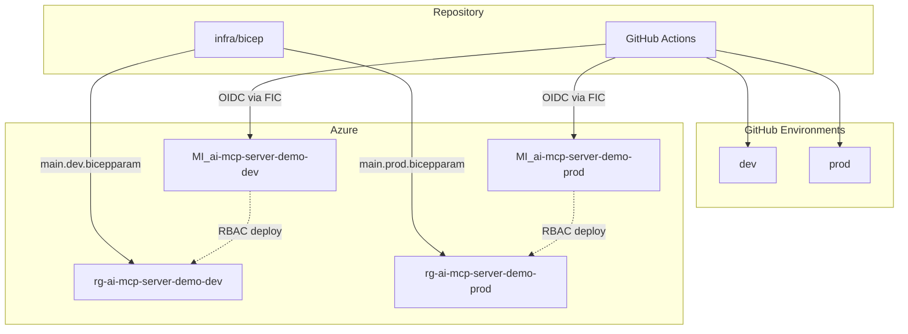
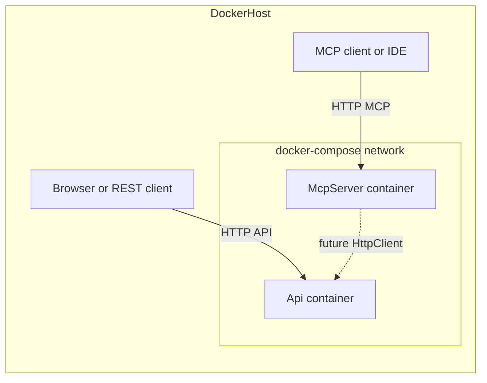

# .NET MCP server + API + Docker Compose

## Clarification on “.NET Framework”

Microsoft’s **Model Context Protocol (MCP) C# SDK** targets modern **.NET** (e.g. .NET 8/9), not legacy **.NET Framework** (4.x). This plan assumes **.NET 9** (current “latest” stable line) unless you prefer **.NET 8 LTS** for longer support windows—either works with the same layout.

## Recommended stack (Microsoft-aligned)

| Piece                   | Choice                                                                                               | Why                                                                                                                                                                                                                                        |
| ----------------------- | ---------------------------------------------------------------------------------------------------- | ------------------------------------------------------------------------------------------------------------------------------------------------------------------------------------------------------------------------------------------ |
| MCP implementation      | Official NuGet: **ModelContextProtocol**, **ModelContextProtocol.AspNetCore**                        | Maintained with Microsoft; supports current protocol versions; HTTP/SSE fits containers ([csharp-sdk](https://github.com/modelcontextprotocol/csharp-sdk), [Get started with MCP](https://learn.microsoft.com/dotnet/ai/get-started-mcp)). |
| MCP transport in Docker | **ASP.NET Core** hosting with the AspNetCore package                                                 | **stdio** MCP is a poor fit for normal Docker networking; **HTTP/SSE** maps cleanly to exposed ports and load balancers.                                                                                                                   |
| API                     | **ASP.NET Core Web API**                                                                             | Minimal APIs or controllers; **OpenAPI** via Swashbuckle or built-in `.NET 9` OpenAPI; **health checks** for Compose/orchestrators.                                                                                                        |
| Containers              | Official images: `mcr.microsoft.com/dotnet/sdk` (build), `mcr.microsoft.com/dotnet/aspnet` (runtime) | Microsoft’s documented baseline for .NET in Docker.                                                                                                                                                                                        |
| Azure runtime           | **Azure Container Apps** + **Azure Container Registry**                                              | Two apps (Api, McpServer); revisions and ingress managed by Container Apps—not AKS for this repo.                                                                                                                                          |

## Solution layout (proposed)

```text
ai-mcp-server-demo/
  .github/
    workflows/
      ci.yml                   # build + test on PR/push (optional: Docker build validate)
      deploy-azure.yml         # deploy to Azure; targets GitHub Environments dev / prod
  infra/
    bicep/
      main.bicep               # orchestrates modules; RG rg-ai-mcp-server-demo-{env}, location australiaeast
      modules/                 # reusable pieces (see Azure section below)
      parameters/
        main.dev.bicepparam    # Dev stack (naming, SKUs, flags)
        main.prod.bicepparam   # Prod stack
  src/
    McpServer/                 # ASP.NET Core app hosting MCP over HTTP
    Api/                       # Standalone Web API (future: called from MCP tools)
  docker/
    McpServer.Dockerfile
    Api.Dockerfile             # or a single multi-stage Dockerfile with two targets (optional)
  docker-compose.yml
  .dockerignore
  Directory.Build.props        # shared TFM, nullable, implicit usings
  ai-mcp-server-demo.sln
```

- **Two processes, two containers**: Keeps the API independent today and matches your “standalone API” requirement; later, MCP tools can call the API over the Compose network by **service name** (e.g. `http://api:8080`).
- **`infra/` + `.github/`**: Keeps **Infrastructure as Code** and **CI/CD** separate from application code, which is the usual layout for GitHub Actions + Azure ([Bicep](https://learn.microsoft.com/azure/azure-resource-manager/bicep/overview) modules and reusable workflows).

## Azure (Bicep) — Dev and Prod

### Hosting decision: Azure Container Apps

**Api** and **McpServer** run in Azure as **two separate Azure Container Apps** (two container images from **Azure Container Registry**), inside a **Container Apps** managed environment per region/stack. This plan **does not** target **Azure Kubernetes Service (AKS)**; operations stay at the Container Apps / revisions / ingress layer unless requirements change later.

**Goal**: One **parameterized** Bicep entry (`infra/bicep/main.bicep`) with **two** parameter files — **`parameters/main.dev.bicepparam`** and **`parameters/main.prod.bicepparam`** — so Dev and Prod differ by **SKUs and feature flags** without duplicating logic; **resource group name** and **Azure region** are **fixed** per this plan. Use **`.bicepparam`** (supported by current Bicep CLI / ARM) for clear per-environment inputs; alternatively JSON parameter files work if you standardize on `az deployment` JSON params.

### Phased infrastructure (recommended)

Deploy in **two waves** so GitHub Actions OIDC works before ACR / Container Apps exist:

1. **Phase 1 — CI/CD only (minimum Azure)**: **Resource group** **`rg-ai-mcp-server-demo-{env}`**, **user-assigned managed identity** **`MI_ai-mcp-server-demo-{env}`**, **federated identity credentials (FIC)** for GitHub Actions OIDC, and **RBAC** on that identity (typically **Contributor** on the resource group so later pipelines can deploy Phase 2 resources—narrower roles are possible but require more tuning). **No** ACR, Container Apps, or Log Analytics in this phase if the goal is strictly **enable `azure/login` + build/test workflows**.  
   - **Bootstrap path (authoritative for first landing)**: provision Phase 1 using the **Azure CLI** from a documented, repeatable script or command list (see **Phase 1 bootstrap (Azure CLI)** below). **Bicep** for the same resources is **optional** and can follow for IaC parity once bootstrap is verified.
2. **Phase 2 — Container Apps runtime**: **Azure Container Registry**, **Container Apps environment**, **two Container Apps** (Api, McpServer), optional **Log Analytics**, **AcrPull** / workload identities. CI/CD then **pushes** images and **updates** revisions (Bicep and/or `az containerapp update`).

Parameter files and modules can use **feature flags** or separate deployments so Phase 1 ships first.

### Phase 1 bootstrap (Azure CLI)

For the **first** creation of Phase 1 resources (and for teams that prefer imperative bootstrap over Bicep), document and run **Azure CLI** commands similar to the following (replace placeholders; repeat per **`dev`** / **`prod`**):

1. **`az login`** — interactive user or bootstrap principal with permission to create resource groups, managed identities, federated credentials, and role assignments in the subscription.
2. **`az group create`** — **`--resource-group rg-ai-mcp-server-demo-{env}`**, **`--location australiaeast`**.
3. **`az identity create`** — **`--name MI_ai-mcp-server-demo-{env}`**, **`--resource-group rg-ai-mcp-server-demo-{env}`**, **`--location australiaeast`**. Record the identity’s **clientId** (used as GitHub **`AZURE_CLIENT_ID`**).
4. **`az role assignment create`** — assign the UAMI **Contributor** (or a narrower custom role) on scope **`/subscriptions/{subscriptionId}/resourceGroups/rg-ai-mcp-server-demo-{env}`** using the identity’s **principalId** as **`--assignee-object-id`** with **`--assignee-principal-type ServicePrincipal`** (or use **`--assignee`** with client id per current `az` CLI behavior).
5. **`az identity federated-credential create`** — create at least one **FIC** per environment with **issuer** `https://token.actions.githubusercontent.com`, **audience** `api://AzureADTokenExchange`, and **subject** matching your GitHub workflow (recommended: **`repo:<Org>/<Repo>:environment:<env>`** when using GitHub Environments **`dev`** / **`prod`**).

Commit the exact command sequence (with placeholders) to repo docs—e.g. **`README.md`** or **`docs/azure-bootstrap.md`** when you implement the **`github-actions`** / **`readme`** steps—not only narrative prose.

After bootstrap, GitHub Actions uses **`azure/login`** with **OIDC** and the UAMI **client id**; no client secret.

### Resource group and region (fixed)

All deployable resources for a given stack live in **one resource group per environment**:

- **Name pattern**: **`rg-ai-mcp-server-demo-{env}`** with `{env}` = **`dev`** | **`prod`** (e.g. `rg-ai-mcp-server-demo-dev`, `rg-ai-mcp-server-demo-prod`).
- **Region**: **`Australia East`** — use ARM/Bicep location **`australiaeast`** everywhere regional resources are created (resource group, Container Apps, ACR if colocated, Log Analytics, user-assigned managed identities, etc.).

Deployments target **`az deployment group create`** (or equivalent) scoped to that resource group at **`australiaeast`**. Do not split Dev/Prod across regions in this plan.

**Typical resources** for containerized ASP.NET Core + MCP on **Azure Container Apps** (exact modules can start minimal and grow; align Phase 2 with this list):

- **Resource group**: As above — **one RG per environment**, no shared RG between Dev and Prod.
- **Azure Container Registry (ACR)**: Per-env or shared; images tagged by Git SHA + environment; Container Apps pull from ACR (managed identity **AcrPull**).
- **Container Apps environment** + **two Container Apps** (one for **McpServer**, one for **Api**): separate revisions, scaling rules, and ingress as needed; use **internal** ingress for Api if MCP should call Api only inside the environment, or expose both publicly per your threat model.
- **Log Analytics** workspace for Container Apps diagnostics (optional but aligns with observability best practices).
- **Workload identities (apps)**: User-assigned or system-assigned MIs on Container Apps for **AcrPull** and runtime Azure SDK calls; keep **separate** from the **deployment** UAMI **`MI_ai-mcp-server-demo-{env}`** used by GitHub Actions.

Other Azure container hosting options (e.g. **Web App for Containers**) are **out of scope** for this repo unless you explicitly adopt them later.

### User-assigned managed identity for GitHub Actions (OIDC)

Provision a **user-assigned managed identity** per environment **in `rg-ai-mcp-server-demo-{env}`** at **`australiaeast`** with this **name pattern** ( `{env}` = `dev` | `prod` ):

- **`MI_ai-mcp-server-demo-{env}`** (e.g. `MI_ai-mcp-server-demo-dev`, `MI_ai-mcp-server-demo-prod`)

Azure allows alphanumeric characters, hyphens, and underscores in this resource name; treat the pattern as fixed so Bicep and docs stay consistent.

On each identity, enable **federated identity credentials (FIC)** for **GitHub Actions OIDC**:

- **Issuer**: `https://token.actions.githubusercontent.com`
- **Subject** (recommended for environment-scoped workflows): `repo:<GitHubOrg>/<repo>:environment:<env>` matching GitHub Environments **`dev`** / **`prod`** (or use branch/tag subjects if you standardize differently—pick one pattern and document it).
- **Audience**: `api://AzureADTokenExchange` (standard for Entra workload federation).

Implement in Bicep using the **`Microsoft.ManagedIdentity/userAssignedIdentities/federatedIdentityCredentials`** resource type (API version per current Bicep docs), parameterized with **`githubOrg`**, **`githubRepo`**, and **`environment`** so subjects are generated, not hard-coded secrets.

**RBAC for deployment**: Grant this UAMI what it needs to deploy and operate the stack (e.g. **Contributor** on the target resource group, or finer-grained roles if you split responsibilities). Container Apps’ runtime identities can remain distinct **app** MIs with **AcrPull** only.

### First run (bootstrap, Azure CLI) vs. ongoing (OIDC in GitHub)

| Phase | Who authenticates | Purpose |
|-------|-------------------|---------|
| **Bootstrap / first run** | **Azure CLI** after **`az login`** (user or bootstrap SP with rights to create RG, identities, FIC, role assignments) | **Primary:** Run the **Phase 1 bootstrap** commands above so **`rg-ai-mcp-server-demo-{env}`**, **`MI_ai-mcp-server-demo-{env}`**, **FIC**, and **RBAC** exist. **Optional:** `az deployment group create` with Bicep once templates exist (same resources as Phase 1 or full stack). Document subscription id, RG name, identity client id, and FIC subjects next to the commands. |
| **Ongoing** | **GitHub Actions** via **`azure/login`** + **OIDC** | Use the **client (application) ID** of **`MI_ai-mcp-server-demo-{env}`** as `client-id` (and tenant/subscription ids). No long-lived client secrets for this path. |

Store **`AZURE_CLIENT_ID`** (UAMI client id), **`AZURE_TENANT_ID`**, and **`AZURE_SUBSCRIPTION_ID`** in **GitHub Environment** or repository variables as appropriate—**not** the identity’s name string, which is for Azure resource correlation only.

**Modules** under `infra/bicep/modules/` (illustrative — **optional** until after CLI bootstrap; Phase 1 can ship **`managed-identity-github.bicep`** only; Phase 2 adds the rest):

- **`managed-identity-github.bicep`**: UAMI **`MI_ai-mcp-server-demo-{env}`** + FIC for GitHub OIDC.
- **`acr.bicep`**: Container registry for images.
- **`container-apps-env.bicep`** / **`container-apps-apps.bicep`** (or a single **`container-apps.bicep`**): managed environment + **Api** and **McpServer** apps.
- **`log-analytics.bicep`** (optional): workspace wired to Container Apps diagnostics.

Each module should have a clear `param` contract so Phase 1 and Phase 2 compose cleanly.

**Secrets**: Do **not** put secrets in `.bicepparam` committed to git. Use **Azure Key Vault references** or **Container Apps secrets** populated by the pipeline / manual seeding; parameter files hold **Key Vault URI** or **secret names**, not values.

## GitHub Actions — folder structure and environments

**Workflows** under [`.github/workflows/`](.github/workflows/):

| Workflow | Role |
|----------|------|
| **`ci.yml`** | On PR / push to default branch / configured branches: `dotnet restore/build/test`, optionally `docker build` to validate Dockerfiles (no push to Azure). |
| **`deploy-azure.yml`** | **`azure/login`** (OIDC) + **`az deployment group create`** for **`infra/bicep/main.bicep`** (requires RG **`rg-ai-mcp-server-demo-{env}`** already); prints deployment outputs; then **`dotnet build/test`**. **Optional next:** **docker push** to ACR + **`az containerapp update`** or param-only redeploy for app images. Use **`jobs.<job>.environment: dev \| prod`**. |

**Auth to Azure (after bootstrap)**:

- **`azure/login`** with **`client-id`** = **client (application) ID** of the user-assigned MI **`MI_ai-mcp-server-demo-{env}`** (same environment as the GitHub Environment on the job).
- **`tenant-id`**, **`subscription-id`** as usual.
- **No** stored client secret for this flow; trust is established via **FIC** on that managed identity.

**Repository variables / secrets** (examples — names illustrative):

- **`AZURE_CLIENT_ID`** — UAMI **client id** (per environment: aligns with `MI_ai-mcp-server-demo-dev` vs `...-prod` if you use separate vars per GitHub Environment).
- **`AZURE_TENANT_ID`**, **`AZURE_SUBSCRIPTION_ID`**.
- Per-environment values in **GitHub Environment** `dev` / `prod`: **`rg-ai-mcp-server-demo-{env}`**; after Phase 2, add ACR name, Container Apps names, etc.

**Two environments**: Configure **GitHub Environments** named **`dev`** and **`prod`**; subjects in **FIC** should match (`:environment:dev` / `:environment:prod`). Map **Prod** to required reviewers / wait timer if desired.



## MCP server project (essentials)

- Target **.NET 9**; add **ModelContextProtocol** + **ModelContextProtocol.AspNetCore**.
- Configure Kestrel to listen on `0.0.0.0` and a fixed port (e.g. **8080**) for Docker.
- Register MCP in the host using the SDK’s ASP.NET Core integration (map the MCP endpoint per package docs—typically alongside standard middleware).
- Add **1–2 sample tools** (e.g. `ping` / `get_server_info`) so you can verify the server from an MCP client without the API.
- Add **health** (`/health` or `/alive`) for Docker `HEALTHCHECK` / orchestration.

## API project (essentials)

- Standard **Web API** with:
  - Example CRUD or a trivial `GET /api/health` + `GET /api/echo` to prove routing.
  - **Health checks** endpoint.
  - **OpenAPI** in Development (optional but aligns with “best practices” for discoverability).
- **No MCP coupling yet**—only shared conventions (logging, configuration) so adding `HttpClient` + options from MCP tools later is straightforward.

## Configuration and `IOptions<T>`

Both **McpServer** and **Api** will use the **options pattern** for typed settings:

- Define POCOs (e.g. `McpOptions`, `ApiOptions`, or a shared `AppOptions` section) and bind with `services.Configure<T>(configuration.GetSection("SectionName"))` (or `Bind` on the section).
- Inject **`IOptions<T>`** (singleton), **`IOptionsSnapshot<T>`** (scoped, reload-friendly), or **`IOptionsMonitor<T>`** (singleton + change notifications) where appropriate—at minimum **`IOptions<T>`** for static startup values.

**Precedence when the same key exists** (your requirement): **User Secrets → appsettings → environment variables**, meaning **highest priority = User Secrets**, then **appsettings**, then **environment variables** (lowest).

In ASP.NET Core, **later configuration providers override earlier ones** for duplicate keys. Implementation will **not** rely on the default `WebApplication.CreateBuilder` ordering (where environment variables typically override user secrets). Instead, **`Program.cs` will configure the host’s `ConfigurationBuilder` explicitly** so providers are added in this order (lowest to highest priority):

1. **Environment variables** (lowest priority for conflicts)—still the primary way to inject values in **Docker/production** where User Secrets are absent.
2. **`appsettings.json`** and **`appsettings.{Environment}.json`** (optional, reload in dev).
3. **User secrets** (highest priority)—enabled via `UserSecretsId` in each project’s `.csproj` for **local development** only; values win over JSON and env vars when present.

Use `ConfigureAppConfiguration` (or equivalent) so this ordering is clear and documented in code comments. **Docker images** will not contain user secrets; Compose/env files continue to drive containers.

## Cross-cutting “Microsoft best practices”

- **Configuration**: Typed options via **`IOptions<T>`**; layered sources as above; **secrets** not baked into images—use env vars in Compose, User Secrets locally, Key Vault later if needed.
- **Logging**: `ILogger` + structured logging; console provider enabled for container logs.
- **Security (baseline)**:
  - Run container as **non-root** user where the base image allows (official aspnet images support `USER $APP_UID` pattern in Microsoft’s samples).
  - Do not expose unnecessary ports; only publish MCP + API ports needed for dev.
- **Docker**:
  - **Multi-stage** builds: restore/build in `sdk` image, copy published output to `aspnet` runtime.
  - **`.dockerignore`** to exclude `bin/`, `obj/`, `.git`, etc., for faster, smaller builds.

## Local development and debugging (developer machines)

Developers must be able to **run**, **test**, and **debug** **`McpServer`** and **`Api`** on a workstation **without Azure** or **GitHub**—Azure is only needed when deploying infrastructure or running cloud-specific integration tests.

### What to install (prerequisites)

| Prerequisite | Purpose |
|--------------|---------|
| **.NET 9 SDK** (matching [`global.json`](global.json) if the repo pins a feature band) | Build, run, test, and debug. Verify with `dotnet --version`. |
| **Git** | Clone and branch workflow. |
| **IDE or editor with C# debugging** | **Visual Studio 2022** (Windows/Mac), **VS Code** with [C# Dev Kit](https://marketplace.visualstudio.com/items?itemName=ms-dotnettools.csdevkit) (or C# extension), or **JetBrains Rider**. |
| **Docker Desktop** (or compatible engine + Compose plugin) | **Optional** for `docker compose` parity testing; **not** required if you only use `dotnet run` for both projects. |

No **Azure CLI**, **subscription**, or **Entra** login is required for everyday local app development—only for Bicep deployment and cloud workflows (document that distinction in the README).

### Repository setup (once per clone)

1. Clone the repo and open **`ai-mcp-server-demo.sln`** in your IDE.
2. **`dotnet restore`** at the solution root (IDE usually runs this automatically).
3. **User secrets** (per project): after `UserSecretsId` is set, run `dotnet user-secrets init` in each of `src/McpServer` and `src/Api` if not already scaffolded; developers set overrides with `dotnet user-secrets set` as documented in the README (no secrets committed).

Optional: trust the ASP.NET Core dev HTTPS certificate if profiles use HTTPS: `dotnet dev-certs https --trust` (OS-specific prompts).

### Run without debugging

- From the repo root: **`dotnet run --project src/McpServer/...`** and **`dotnet run --project src/Api/...`** in **two terminals**, **or**
- **`dotnet watch run`** for hot reload during UI/API iteration.

**`Properties/launchSettings.json`** in each project must define **stable, distinct localhost URLs/ports** for **Development** (e.g. Api on one port, McpServer on another—documented in README so MCP clients and browsers know where to connect). Align **`ASPNETCORE_ENVIRONMENT=Development`** for local runs.

### Debug (breakpoints, step-through)

- **Visual Studio**: Configure the solution for **multiple startup projects** (McpServer + Api) so **F5** launches both processes and attaches the debugger to each.
- **VS Code**: Add committed **[`.vscode/launch.json`](.vscode/launch.json)** with a **compound** configuration that starts both apps (and **[`.vscode/tasks.json`](.vscode/tasks.json)** `dotnet build` tasks if useful) so developers can **F5** without manual setup. Keep paths portable (use `${workspaceFolder}`).
- **Rider**: Multi-project run configuration or two run configs used together.

Implementation includes these **launch profiles** and optional **VS Code** files as part of the deliverable, not as optional afterthoughts.

### Verify endpoints locally

- **API**: Browser or `curl` against the OpenAPI/health URLs from README.
- **McpServer**: HTTP MCP endpoint and health URL as documented; use an MCP-capable client or test tool appropriate to the transport you expose.

### Docker Compose vs. native `dotnet run`

- **`dotnet run`** / IDE: fastest edit-debug loop, best for breakpoint debugging.
- **`docker compose up`**: validates **container images**, networking, and env injection—use before merging Dockerfile changes or when reproducing container-only issues.

## Docker Compose

- **Services**: `mcp` and `api` (names illustrative).
- **Build**: `build.context` pointing at repo root or `src/`, with Dockerfile path under `docker/`.
- **Networking**: default bridge network; API reachable at `http://api:<internal-port>` from MCP container.
- **Ports**: map host ports (e.g. MCP **5001**, API **5002**) to avoid clashes; document in a short comment in the file.
- **depends_on** (optional): MCP may `depends_on: api` if you add a startup probe; for fully independent apps, omit until tools call the API.
- **Environment**: e.g. `Api__BaseUrl=http://api:8080` on the MCP service as a **placeholder** for future HttpClient-based tools (not required for the first vertical slice).

Single command: `docker compose up --build` from the repo root.



## Future hook (document only, minimal code now)

- In **McpServer**, reuse **`IOptions<ApiClientOptions>`** (or similar) with `IHttpClientFactory` when exposing API operations as tools: base URL and timeouts from configuration, resilient calls, cancellation tokens. The same precedence rules apply (`ApiClient__BaseUrl` in user secrets overrides Compose env vars during local dev).
- Optionally add a **shared contracts** class library later for DTOs shared between API and MCP.

## Implementation order (when you exit plan mode)

1. `dotnet new sln -n ai-mcp-server-demo` (produces **`ai-mcp-server-demo.sln`**) + create **Api** and **McpServer** projects; add to solution; shared `Directory.Build.props`; optional **[`global.json`](global.json)** to pin SDK; add **UserSecretsId**, **explicit configuration provider order**, and at least one **`IOptions<T>`** binding per app (e.g. URLs, feature flags) used in startup or a sample endpoint.
2. Implement MCP host + sample tools; add **`Properties/launchSettings.json`** with fixed **Development** ports/URLs; verify with **`dotnet run`** and **IDE debugging** (breakpoints).
3. Implement API + health + sample endpoints; **`launchSettings`** for Api; **multiple startup projects** (VS) and/or **`.vscode` compound launch** (VS Code) so both apps start for local debugging.
4. Add Dockerfiles + `.dockerignore` + `docker-compose.yml`; verify `docker compose up --build`.
5. **Bootstrap Phase 1 in Azure** using **Azure CLI** (document **`az group create`**, **`az identity create`**, **`az role assignment create`**, **`az identity federated-credential create`** for **`dev`** / **`prod`**). Optionally add **`infra/bicep`** later with **`managed-identity-github.bicep`** (and eventually **ACR + Container Apps**); validate Bicep with `az bicep build` / what-if when present.
6. Add **`.github/workflows`** (`ci.yml`, `deploy-azure.yml` with **`environment: dev`** / **`prod`**); **`azure/login`** OIDC using each UAMI’s **client id**; Phase 1 deploy job = auth + build/test only; document GitHub Environments ↔ FIC subjects and variable names beside the bootstrap doc.
7. README: **Local development** (prerequisites from the plan section, clone/restore, user secrets, **`dotnet run` vs IDE debug**, ports/URLs, when Docker is needed, **no Azure for day-to-day dev**); plus ports, health/OpenAPI/MCP URL, **configuration precedence**, **Azure** ( **`rg-ai-mcp-server-demo-{env}`**, **`australiaeast`**, **Phase 1 Azure CLI bootstrap** commands for RG + UAMI + FIC + RBAC, **Phase 2** **Container Apps** + ACR overview, **`MI_ai-mcp-server-demo-{env}`**, **OIDC** variables), and GitHub Environments.

### Local dev execution plan (step 3 / todo `local-dev`)

Use this as the checklist for the branch that completes **`local-dev`** (IDE multi-start + minimal docs). Full narrative README polish can still land in **step 7** (`readme` todo); this step must leave enough for a developer to run and debug without reading the whole plan.

**Current ports (from `launchSettings` — do not change silently without updating docs)**

| App | HTTP | HTTPS |
|-----|------|--------|
| **Api** | `http://localhost:5101` | `https://localhost:7268` |
| **McpServer** | `http://localhost:5136` | `https://localhost:7137` |

**Deliverables**

1. **VS Code (commit to repo)**  
   - **[`.vscode/launch.json`](.vscode/launch.json):** two launch configs (e.g. `Api (http)`, `McpServer (http)`) using **`dotnet` type** / **`project`** path under `${workspaceFolder}`, **`ASPNETCORE_ENVIRONMENT=Development`**.  
   - **Compound** configuration that starts **both** (label e.g. `Api + McpServer (http)`).  
   - Optional **[`.vscode/tasks.json`](.vscode/tasks.json):** `dotnet build` on the solution for pre-launch if you want a consistent build step.

2. **Visual Studio**  
   - No mandatory repo file: document **Solution → Configure Startup Projects → Multiple startup projects** (Api + McpServer, both **Start**) in README or `docs/local-development.md`.

3. **Documentation (minimal; aligns with `local-dev` todo)**  
   - Add **[`README.md`](README.md)** (if missing) or **[`docs/local-development.md`](docs/local-development.md)** with: **prerequisites** (.NET 9 SDK), **`dotnet restore`**, **two-terminal** `dotnet run` commands with `--project` paths, **port table** above, **OpenAPI** in Development (after `MapOpenApi()`, document the OpenAPI endpoint your template exposes—often under `/openapi/`—verify in running app), **MCP / Cursor**: recommend **`http://localhost:5136/`** for `mcp.json` (HTTPS often causes **`fetch failed`** with dev certs).  
   - One line pointing to **configuration precedence** (User Secrets → appsettings → env) and `dotnet user-secrets` per project.

**Acceptance criteria**

- [x] **F5** in VS Code compound launches Api and McpServer; breakpoints hit in both processes. *(Implemented on `feature/003-local-dev`.)*  
- [x] Documented ports match **`launchSettings.json`**.  
- [x] A new developer can find **run**, **debug**, and **Cursor MCP URL** without reading Azure/Docker sections.

**Out of scope for this step**

- Dockerfiles / Compose (**`docker`** todo).  
- Full Azure/GHA README (**step 7** / **`readme`** todo)—only **local** content here.

## Files to add (high level)

- [`docs/implementation-status.md`](docs/implementation-status.md) — **implementation tracker** (Option A); update when each plan step merges ([`plan.md`](plan.md) § Implementation order).
- [`ai-mcp-server-demo.sln`](ai-mcp-server-demo.sln) — solution file.
- [`README.md`](README.md) — prerequisites, local run/debug, ports, OpenAPI, Cursor MCP URL (expand in **`readme`** todo for Docker/Azure/GHA).
- [`src/McpServer/`](src/McpServer/) — MCP ASP.NET Core project + `Program.cs`, `appsettings*.json`, [`Properties/launchSettings.json`](src/McpServer/Properties/launchSettings.json).
- [`src/Api/`](src/Api/) — Web API project + [`Properties/launchSettings.json`](src/Api/Properties/launchSettings.json).
- Optional: [`global.json`](global.json) — pin .NET SDK version.
- [`.vscode/launch.json`](.vscode/launch.json), [`.vscode/tasks.json`](.vscode/tasks.json) — compound **Api + McpServer (http)** for VS Code.
- [`docker/McpServer.Dockerfile`](docker/McpServer.Dockerfile), [`docker/Api.Dockerfile`](docker/Api.Dockerfile) — multi-stage.
- [`docker-compose.yml`](docker-compose.yml) — two services, ports, build contexts.
- [`.dockerignore`](.dockerignore)
- Documented **Azure CLI bootstrap** for Phase 1 (commands may live in [`README.md`](README.md) or e.g. [`docs/azure-bootstrap.md`](docs/azure-bootstrap.md) when implemented).
- [`infra/bicep/main.bicep`](infra/bicep/main.bicep), [`infra/bicep/modules/`](infra/bicep/modules/) (**optional** after bootstrap — **`managed-identity-github.bicep`**, then **`acr.bicep`**, **`container-apps*.bicep`**, optional **`log-analytics.bicep`** for Phase 2), [`infra/bicep/parameters/main.dev.bicepparam`](infra/bicep/parameters/main.dev.bicepparam), [`infra/bicep/parameters/main.prod.bicepparam`](infra/bicep/parameters/main.prod.bicepparam)
- [`.github/workflows/ci.yml`](.github/workflows/ci.yml), [`.github/workflows/deploy-azure.yml`](.github/workflows/deploy-azure.yml)

Repo docs: root [**README.md**](README.md), [**plan.md**](plan.md), and [**docs/implementation-status.md**](docs/implementation-status.md) for step-by-step progress.
